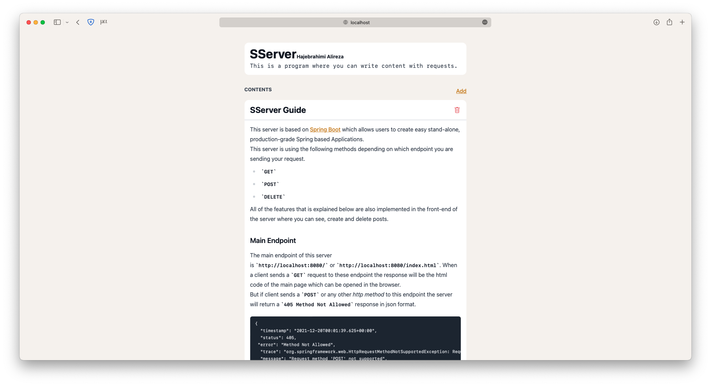
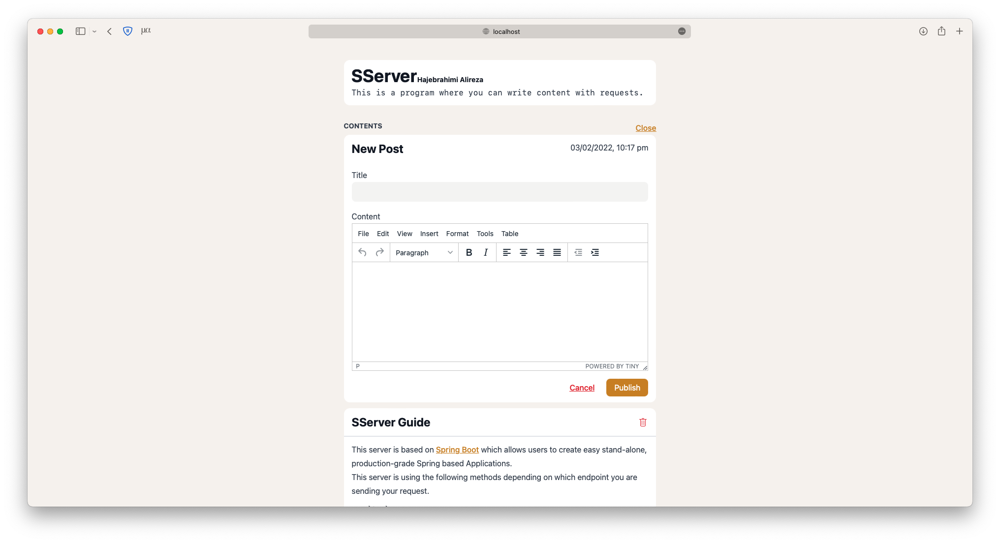
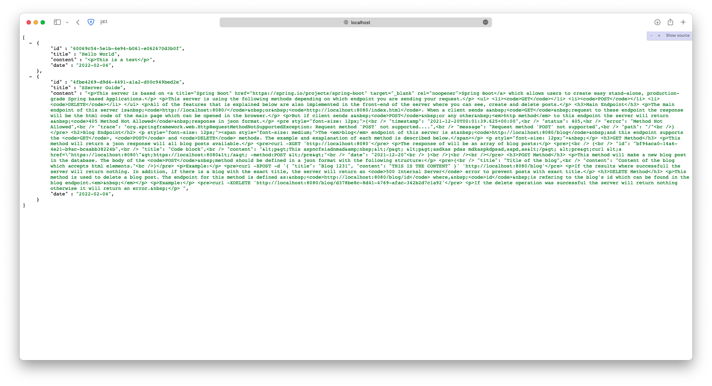
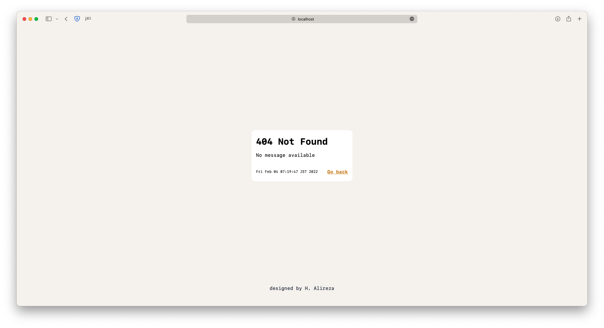

# SServer Application

The SServer java program is a TCP based server with blog storing/displaying functionalities using NoSQL database model. The program also includes REST API endpoint.
For sserver guide see the [wiki](https://github.com/iarata/sserver/wiki) pages.

  

## Getting Started

These instructions will get you a copy of the project up and running on your local machine.

- Make sure that you have the java 17.0.1 or higher.
- From the [Releases](https://github.com/iarata/sserver/releases) section download the latest version .jar file.
- Open a terminal in the same folder as .jar file.
- In terminal execute the following command: `java -jar sserver-0.0.1.jar` This will start the program on port 8080.
- If you want to change the port add the following argument: `--server.port=8083`

| Home Page | New Post | REST API | Errors |
| ------------- | ------------- | ------------- | ------------- |
|   |   |   |   |

### Features

- Add blog content
- REST API endpoint with support of `GET`,`POST` and `DELETE` methods
- WYSIWYG Editor
- HTML built with TailwindCSS

## Built with

- Java (17.0.1)
- TailwindCSS

Frameworks:
- Spring Framework

## Authors

- **Hajebrahimi Alireza** - [iarata](https://github.com/iarata)

## License

This project is licensed under the MIT License - see the [LICENSE](LICENSE) file for details

### Reference Documentation

For further reference, please consider the following sections:

* [Official Apache Maven documentation](https://maven.apache.org/guides/index.html)
* [Spring Boot Maven Plugin Reference Guide](https://docs.spring.io/spring-boot/docs/2.6.1/maven-plugin/reference/html/)
* [Create an OCI image](https://docs.spring.io/spring-boot/docs/2.6.1/maven-plugin/reference/html/#build-image)
* [Spring Boot DevTools](https://docs.spring.io/spring-boot/docs/2.6.1/reference/htmlsingle/#using-boot-devtools)
* [Spring Web](https://docs.spring.io/spring-boot/docs/2.6.1/reference/htmlsingle/#boot-features-developing-web-applications)
* [Spring Web Services](https://docs.spring.io/spring-boot/docs/2.6.1/reference/htmlsingle/#boot-features-webservices)
* [Thymeleaf](https://docs.spring.io/spring-boot/docs/2.6.1/reference/htmlsingle/#boot-features-spring-mvc-template-engines)
* [Spring Data MongoDB](https://docs.spring.io/spring-boot/docs/2.6.1/reference/htmlsingle/#boot-features-mongodb)
* [WebSocket](https://docs.spring.io/spring-boot/docs/2.6.1/reference/htmlsingle/#boot-features-websockets)

### Guides

The following guides illustrate how to use some features concretely:

* [Building a RESTful Web Service](https://spring.io/guides/gs/rest-service/)
* [Serving Web Content with Spring MVC](https://spring.io/guides/gs/serving-web-content/)
* [Building REST services with Spring](https://spring.io/guides/tutorials/bookmarks/)
* [Producing a SOAP web service](https://spring.io/guides/gs/producing-web-service/)
* [Handling Form Submission](https://spring.io/guides/gs/handling-form-submission/)
* [Accessing Data with MongoDB](https://spring.io/guides/gs/accessing-data-mongodb/)
* [Using WebSocket to build an interactive web application](https://spring.io/guides/gs/messaging-stomp-websocket/)
